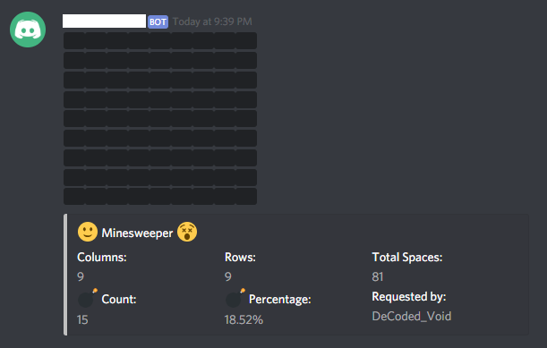

# Minesweeper_discord.py
A minesweeper command utilizing spoiler tags and embeds from discord.
The file in this repository is a cog and can be loaded into an existing bot.

### Requirements:
* Python 3.6+
* [discord.py rewrite](https://github.com/Rapptz/discord.py/tree/rewrite/)

### Syntax:
> [Prefix]minesweeper [columns] [rows] [bombs]

### Example:
> !minesweeper 9 9 15

